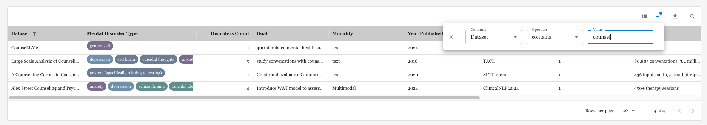
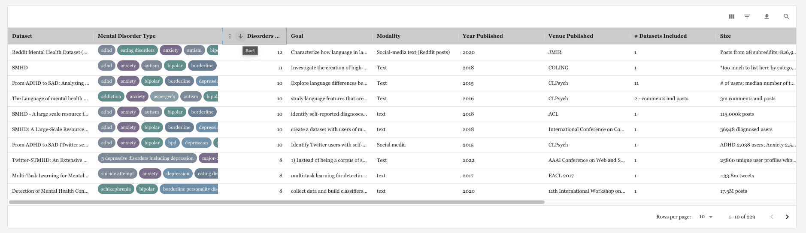
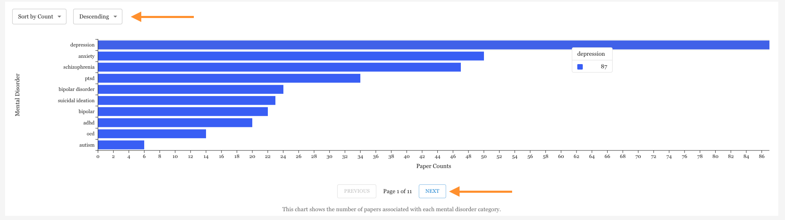
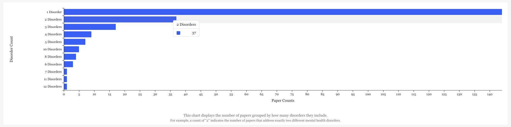
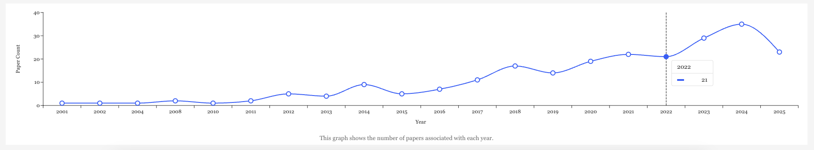

# Anonymous Resource Repository

This repository accompanies a submission under double-blind review and provides materials necessary for evaluating the proposed resource and methodology.

---

## Note on the Interactive Website

This work is accompanied by a fully functional, interactive website that hosts the complete dataset summary tables and visualizations described in the paper.

To ensure strict adherence to the double-blind review policy and to prevent potential identity revelation (e.g., via URLs, hosting metadata, or IP-based attribution), the live website link is intentionally not included in this anonymous submission.

This omission is solely for anonymization purposes and does not reflect the absence of an implemented system.

---

## What Is Provided in This Repository

To allow reviewers to assess the functionality and design of the interactive resource, we provide:

- The complete website source code (anonymized)
- Static data files used to generate the tables
- Screenshots demonstrating key interactive features, including:
  - Dataset filtering
  - Column-based sorting
  - Summary visualizations

The live website will be made publicly accessible upon acceptance.

---

## Screenshots of the Interactive Interface

Below are representative screenshots of the interactive website. All screenshots have been carefully reviewed to remove or obscure any author, affiliation, funding, or identity-related information.

### Screenshot 1: Dataset Overview Table (with Pagination)

*Figure 1a. Paginated dataset overview table.*

### Screenshot 2: Filtering and Sorting Interface

*Figure 2a. Column-based filtering interface.*

*Figure 2b. Column-based sorting interface.*

### Screenshot 3: Mental Disorder Chart Visualization (with Pagination nad Sorting)

*Figure 3. Aggregated number of papers associated with each mental disorder category.*

### Screenshot 4: Disorder Count Visualization

*Figure 4. The number of papers grouped by how many disorders they include.*

### Screenshot 5: Paper Count Per Year Visualization

*Figure 4. The number of papers associated with each year.*
---

## Anonymity Statement

All identifying information, including author names, institutional affiliations, and repository metadata, has been removed or anonymized in accordance with double-blind review requirements.

